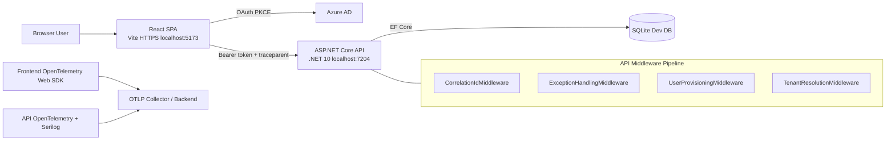

# Karve Invoicing

Karve Invoicing is a full-stack, multi-tenant invoicing platform built as a modern demo of secure, observable, cloud-ready engineering patterns.

It combines:
- A .NET 10 Web API with clean layering and tenant isolation
- A React + TypeScript SPA
- Azure AD OAuth (PKCE for SPA)
- Vendor-neutral OpenTelemetry across backend and frontend
- Structured logging, correlation IDs, and end-to-end trace propagation

## Quick Start

| What | Command | URL |
|---|---|---|
| Run API (HTTPS) | `dotnet run --project src\Karve.Invoicing.Api --launch-profile https-oauth` | https://localhost:7204 |
| Run UI (HTTPS) | `cd src\react\karve-invoicing-ui` then `npm install` then `npm run dev` | https://localhost:5173 |
| API docs (Scalar) | Start API profile above | https://localhost:7204/scalar/v1 |
| Health check | Start API profile above | https://localhost:7204/health |

## Architecture Summary

High-level flow:

```text
Browser (React SPA, Vite, HTTPS)
	-> OAuth PKCE (Azure AD)
	-> ASP.NET Core API (.NET 10, JWT Bearer, Tenant middleware)
	-> EF Core (SQLite dev / Azure SQL-ready model)

Observability:
UI OTel SDK -> OTLP
API OTel + Serilog -> OTLP / Console
Trace context propagated UI -> API
```

## Architecture Diagram



## Key Features

- Multi-company (multi-tenant) domain model
- OAuth-secured API with automatic local user provisioning
- Company membership enforcement and tenant-scoped query filters
- Invoice, customer, product, payment CRUD APIs
- OpenTelemetry traces/metrics/logs (backend) and browser traces (frontend)
- Structured Serilog JSON logging with correlation and trace context
- Playwright and xUnit test coverage, including observability tests

## Tech Stack

### Backend
- .NET 10
- ASP.NET Core Web API
- EF Core 10 + SQLite
- FluentValidation
- AutoMapper
- Microsoft.Identity.Web (Azure AD)
- OpenTelemetry SDK + instrumentations
- Serilog + console sink
- Scalar OpenAPI UI

### Frontend
- React 19 + TypeScript
- Vite 8
- React Router 7
- TanStack Query
- Axios
- Zustand
- MSAL Browser + MSAL React
- OpenTelemetry Web SDK

### Testing
- xUnit + Moq + Microsoft.AspNetCore.Mvc.Testing
- Playwright E2E

## Repository Structure

```text
src/
	Karve.Invoicing.Domain/
	Karve.Invoicing.Application/
	Karve.Invoicing.Infrastructure/
	Karve.Invoicing.Api/
	react/karve-invoicing-ui/

tests/
	Karve.Invoicing.Domain.Tests/
	Karve.Invoicing.Application.Tests/
	Karve.Invoicing.Api.Tests/
```

## Domain Model (Core Entities)

The model tracks the essential invoicing information:
- Companies
- Users and company memberships (CompanyUser)
- Customers
- Products
- Invoices
- Invoice line items
- Payments

Tenant isolation is enforced by:
- Middleware-based company resolution
- Global query filters in DbContext
- Authorization policy requiring company membership

See:
- [src/Karve.Invoicing.Infrastructure/InvoicingDbContext.cs](src/Karve.Invoicing.Infrastructure/InvoicingDbContext.cs)
- [src/Karve.Invoicing.Api/Middleware/TenantResolutionMiddleware.cs](src/Karve.Invoicing.Api/Middleware/TenantResolutionMiddleware.cs)
- [src/Karve.Invoicing.Api/Middleware/UserProvisioningMiddleware.cs](src/Karve.Invoicing.Api/Middleware/UserProvisioningMiddleware.cs)

## Local Setup

## Prerequisites
- .NET SDK 10
- Node.js 20+ and npm
- Trusted local HTTPS certs for ASP.NET Core and browser dev work

## Backend Setup

Run API with the fixed HTTPS profile (port 7204):

```powershell
dotnet run --project src\Karve.Invoicing.Api --launch-profile https-oauth
```

Useful endpoints:
- API base: https://localhost:7204
- Scalar OpenAPI: https://localhost:7204/scalar/v1
- Health check: https://localhost:7204/health

Launch profile source:
- [src/Karve.Invoicing.Api/Properties/launchSettings.json](src/Karve.Invoicing.Api/Properties/launchSettings.json)

## Frontend Setup

```powershell
cd src\react\karve-invoicing-ui
npm install
npm run dev
```

Frontend runs on HTTPS via Vite config:
- https://localhost:5173

Vite HTTPS config source:
- [src/react/karve-invoicing-ui/vite.config.ts](src/react/karve-invoicing-ui/vite.config.ts)

## Environment Variables

### Backend config
Defined in:
- [src/Karve.Invoicing.Api/appsettings.json](src/Karve.Invoicing.Api/appsettings.json)
- [src/Karve.Invoicing.Api/appsettings.Development.json](src/Karve.Invoicing.Api/appsettings.Development.json)

Key sections:
- `ConnectionStrings:DefaultConnection`
- `AzureAd:*`
- `OpenApi:*`
- `OpenTelemetry:*`
- `Serilog:*`

### Frontend config
Defined in:
- [src/react/karve-invoicing-ui/.env.development](src/react/karve-invoicing-ui/.env.development)
- [src/react/karve-invoicing-ui/.env.production](src/react/karve-invoicing-ui/.env.production)

Required values:
- `VITE_API_BASE_URL`
- `VITE_AZURE_AD_CLIENT_ID`
- `VITE_AZURE_AD_TENANT_ID`
- `VITE_AZURE_AD_REDIRECT_URI`
- `VITE_AZURE_AD_API_SCOPE`
- `VITE_OTEL_SERVICE_NAME`
- `VITE_OTEL_EXPORTER_OTLP_ENDPOINT`
- `VITE_ENVIRONMENT`

## Authentication and Authorization

- SPA uses Azure AD OAuth PKCE via MSAL
- API validates bearer tokens using Microsoft.Identity.Web
- On authenticated requests, API:
	- Provisions local user from token claims
	- Resolves company memberships
	- Rejects users with no company membership
- API controllers require company membership policy

Main composition:
- [src/Karve.Invoicing.Api/Program.cs](src/Karve.Invoicing.Api/Program.cs)

## Multi-Tenancy Strategy

Tenant context is resolved per request and applied to data access:
- Local user provisioning middleware
- Company membership middleware
- Global query filters in EF Core (`CurrentCompanyIds`)

This ensures tenant-scoped reads by default and prevents cross-company data leakage.

## Observability

### Backend
- OpenTelemetry traces, metrics, logs
- Instrumentations:
	- ASP.NET Core
	- HttpClient
	- EF Core
	- Runtime metrics
- Export behavior:
	- Development -> console exporters
	- Production -> OTLP when endpoint is valid
- Serilog as primary logger with JSON console output and OTel provider passthrough

Sources:
- [src/Karve.Invoicing.Api/Observability/OpenTelemetryServiceCollectionExtensions.cs](src/Karve.Invoicing.Api/Observability/OpenTelemetryServiceCollectionExtensions.cs)
- [src/Karve.Invoicing.Api/Program.cs](src/Karve.Invoicing.Api/Program.cs)

### Frontend
- OpenTelemetry Web SDK initialization
- Document load + fetch + XHR instrumentation
- Axios interceptor injects `traceparent` and `tracestate`
- Browser trace export to OTLP endpoint

## Testing

## Backend tests

```powershell
dotnet test tests\Karve.Invoicing.Domain.Tests\Karve.Invoicing.Domain.Tests.csproj
dotnet test tests\Karve.Invoicing.Application.Tests\Karve.Invoicing.Application.Tests.csproj
dotnet test tests\Karve.Invoicing.Api.Tests\Karve.Invoicing.Api.Tests.csproj
```

Includes:
- Correlation ID middleware tests
- OpenTelemetry configuration tests
- Integration tests around authentication and tenancy

## Frontend tests

```powershell
cd src\react\karve-invoicing-ui
npm run test:e2e
```

Or run only observability E2E:

```powershell
npx playwright test tests/e2e/otel-observability.spec.ts
```

Playwright config:
- [src/react/karve-invoicing-ui/playwright.config.ts](src/react/karve-invoicing-ui/playwright.config.ts)

## Common Troubleshooting

- Port 5173 already in use:
	- stop listener process, then rerun `npm run dev`
- HTTPS trust issues:
	- trust local dev certs
- Azure AD login failures:
	- verify redirect URI matches frontend URL
- Mixed-content OTLP issues:
	- ensure OTLP endpoint scheme is compatible with frontend HTTPS

## Contributing

Suggested standards:
- Small focused PRs
- Clear commit messages
- Keep domain/application/infrastructure boundaries clean
- Add tests for behavior changes

## Roadmap

- Activate remaining skipped frontend observability error-boundary E2E test
- Expand CI pipeline docs and quality gates
- Optional production hardening:
	- distributed cache
	- containerized local orchestration
	- deployment guides for static UI + hosted API

## License

See [LICENSE](LICENSE).